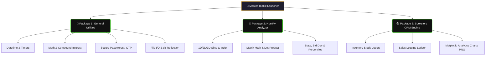

# Bookstore-Inventory-
# 🛠️ Multi-Utility Master Suite

<div align="center">
  <!-- Premium Native CSS Animated Header Card -->
  <div style="background: linear-gradient(135deg, #1e1e2f 0%, #111e38 100%); padding: 35px; border-radius: 12px; box-shadow: 0 6px 20px rgba(0,0,0,0.4); border: 2px solid #39FF14; max-width: 700px; margin: 20px auto; overflow: hidden;">
    <h1 style="color: #FFD166; margin: 0 0 10px 0; font-family: 'Fira Code', monospace; font-size: 28px; text-shadow: 0 0 12px rgba(255,209,102,0.4);">🚀 Core Python Multi-Utility Toolkit</h1>
    
    <!-- CSS Typing Animation -->
    <div style="display: inline-block; font-family: 'Fira Code', monospace; font-weight: 600; font-size: 16px; color: #39FF14; border-right: 2px solid #39FF14; white-space: nowrap; overflow: hidden; width: 0; animation: typing 4s steps(45, end) infinite alternate;">
      3-in-1 Suite: General Utils | NumPy Matrix Analyzer | Bookstore CRM
    </div>
    
    <p style="color: #E2E8F0; margin: 15px 0 0 0; font-family: system-ui, sans-serif; font-size: 14px; line-height: 1.6;">
      A powerful, interactive command-line console powerhouse designed to handle daily system tools, scientific matrix calculations (NumPy), and a complete bookstore inventory-cum-analytics management ecosystem.
    </p>
  </div>
</div>

<style>
  @keyframes typing {
    0% { width: 0; }
    75% { width: 100%; }
    100% { width: 100%; }
  }
</style>

---

## 🗺️ System Architecture (Workflow Flowchart)

The suite is cleanly engineered into 3 modular terminal frameworks, transforming your standard shell interface into a multi-purpose application hub:



---

## ⚡ Core Modules & Features

Click on any package category below to look closer into its specific technical features:

<details open>
<summary>📦 Package 1: General Utilities</summary>
<br>

* 📅 **Time & Calendar:** Display live system clock timestamps and calculate exact date deltas (day differences) between custom dates.
* ⏱️ **Stopwatch & Timers:** Low-level monotonic system interval stopwatch and live-pausing console step-down countdowns.
* 🔐 **Security Tokens:** Dynamically generate cryptographically safe alphanumeric passwords and 4-to-6 digit numeric One-Time Passwords (OTPs).
* 📂 **File Stream I/O & Reflection:** Secure, context-managed file reader/writer operations alongside a python runtime namespace `dir()` inspector.
</details>

<details>
<summary>🧮 Package 2: NumPy Matrix Analyzer</summary>
<br>

* 🧊 **N-Dimensional Array Factory:** Instantly configure multi-dimensional 1D vectors, 2D surfaces, or layered 3D matrices.
* 🔪 **Dynamic Slicing Logic:** Extract matrix views using clean, custom string coordinate array indexing tokens (e.g., `0:2, 1:3`).
* 📈 **Advanced Distributions:** Seamlessly compute element-wise math alongside high-level statistics like Mean, Median, Standard Deviation (σ), and multi-variable correlation coefficients.
</details>

<details>
<summary>📊 Package 3: Bookstore CRM Engine</summary>
<br>

* 📥 **Upsert Catalog Handling:** Add inventory entries safely. Automatically checks for duplicates and cascades matching tokens into bulk volume top-ups rather than cloning records.
* 💰 **Sales Registry Ledger:** Stream customer transaction quantities, subtract units from available warehouse stock, and tally cumulative revenues.
* 🎨 **Matplotlib Graph Generator:** Automatically renders and exports full-color analytical business insight metrics straight into the workspace as local `.png` files:
  - `chart_sales_by_genre.png` (Genre distribution bar graphics)
  - `chart_monthly_trend.png` (Chronological customer volume line trend)
  - `chart_revenue_pie.png` (Financial breakdown profit contribution share split)
  - `chart_price_sales_heatmap.png` (Price elasticity / sales volume clustering matrix)
</details>

---

## 🚀 Installation & Deployment

### 1. Prerequisites (Dependencies)
While the core utilities run strictly on Python's built-in standard library, the advanced **NumPy** and **Bookstore CRM charts** require data-science computation packages. Install them using your preferred terminal terminal:
```bash
pip install numpy pandas matplotlib seaborn
```

### 2. Launch the Application Suite
Ensure you are in the application root directory and type:
```bash
python main_toolkit.py
```

---

## 💻 Sample Console Execution Logs

```text
==========================================
        MULTI-UTILITY MASTER SUITE
==========================================
Current Date and Time: 2026-09-11 12:51:44
Difference: 127 days | Generated Password: TY2QsTi1B1py

--- NumPy Array created successfully ---
[[ 10  30  50]
 [ 70  90 110]]
Standard Deviation of Array: 34.15650255319866

--- Bookstore Summary Report ---
Books in catalog        : 26
Total units in stock    : 1878
Total sales transactions: 825
Total revenue to date   : \$33,763.04

[SAVED] chart_sales_by_genre.png
[SAVED] chart_monthly_trend.png
[SAVED] chart_revenue_pie.png
==========================================
Data saved successfully. Goodbye!
```

---

<!-- GitHub-Friendly Professional UI Custom Theme Style -->
<style>
  summary {
    font-size: 1.1rem;
    padding: 14px;
    background: #0d1117;
    border-radius: 8px;
    margin-bottom: 10px;
    cursor: pointer;
    border-left: 4px solid #39FF14;
    transition: all 0.2s ease-in-out;
    list-style: none;
    font-family: system-ui, sans-serif;
    color: #c9d1d9;
  }
  summary:hover {
    background: #161b22;
    transform: translateX(5px);
    color: #58a6ff;
  }
  summary::-webkit-details-marker {
    display: none;
  }
</style>
