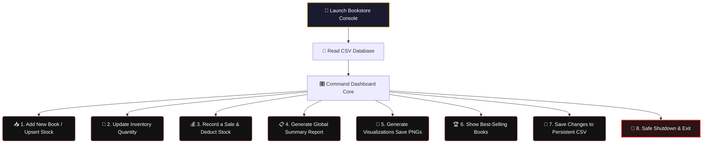

# Bookstore-Inventory-
# 📚 Bookstore Inventory & Analytics System

<div align="center">
  <!-- Premium Native CSS Animated Header Card -->
  <div style="background: linear-gradient(135deg, #1e1e2f 0%, #162a45 100%); padding: 30px; border-radius: 12px; box-shadow: 0 6px 20px rgba(0,0,0,0.4); border: 2px solid #FF6B6B; max-width: 650px; margin: 20px auto; overflow: hidden;">
    <h1 style="color: #FFD166; margin: 0 0 10px 0; font-family: 'Fira Code', monospace; font-size: 26px; text-shadow: 0 0 12px rgba(255,209,102,0.4);">📖 Bookstore CRM & Analytics Engine</h1>
    
    <!-- CSS Typing Animation -->
    <div style="display: inline-block; font-family: 'Fira Code', monospace; font-weight: 600; font-size: 16px; color: #45C4B0; border-right: 2px solid #45C4B0; white-space: nowrap; overflow: hidden; width: 0; animation: typing 4s steps(40, end) infinite alternate;">
      Inventory Tracker | Sales Reports | Automated Charts Generator
    </div>
    
    <p style="color: #E2E8F0; margin: 15px 0 0 0; font-family: system-ui, sans-serif; font-size: 14px; line-height: 1.6;">
      बुकरिकॉर्ड्स और वेयरहाउस स्टॉक को ऑटोमैटिक मैनेज करने, रीयल-टाइम सेल्स डेटा प्रोसेस करने और व्यावसायिक एनालिटिक्स चार्ट (PNG) जेनरेट करने वाला एक दमदार टर्मिनल यूटिलिटी सिस्टम।
    </p>
  </div>
</div>

<style>
  @keyframes typing {
    0% { width: 0; }
    70% { width: 100%; }
    100% { width: 100%; }
  }
</style>

---

## ⚡ मुख्य फीचर्स की झलक (Features)

नीचे दिए गए केटेगरी पर क्लिक करके देखें कि यह सिस्टम क्या-क्या संभाल सकता है:

<details open>
<summary><b>📦 1. स्मार्ट स्टॉक और इन्वेंटरी मैनेजमेंट</b></summary>
<br>

* 🆕 **स्मार्ट कैटलॉगिंग:** नई किताबें जोड़ें। यदि किताब पहले से मौजूद है, तो यह डुप्लिकेट बनाने के बजाय सीधे स्टॉक मात्रा (Quantity) को ऑटो-अपडेट कर देता है।
* 🔄 **मैनुअल स्टॉक ओवरराइड:** किसी भी किताब के स्टॉक को कभी भी सीधे सिंगल कमांड से अपडेट या रीसेट करें।
</details>

<details>
<summary><b>💰 2. लाइव सेल्स ट्रांजैक्शन रजिस्ट्री</b></summary>
<br>

* 📝 **ऑटो-बिलिंग:** रीयल-टाइम बिक्री रिकॉर्ड करें। यह ग्राहकों की खरीद के आधार पर स्टॉक से किताबें घटाता है और कुल रेवेन्यू (Revenue) की सटीक गणना करता है।
</details>

<details>
<summary><b>📋 3. बिजनेस समरी रिपोर्ट ऑडिट</b></summary>
<br>

* 📊 **ऑटोमेटेड लेजर:** एक क्लिक में कैटलॉग में कुल किताबें, स्टॉक में मौजूद कुल यूनिट्स, औसत कीमतें (Average Price) और अब तक की कुल कमाई की पूरी ऑडिट रिपोर्ट देखें।
</details>

<details>
<summary><b>🎨 4. डेटा विज़ुअलाइज़ेशन (Matplotlib Charts Suite)</b></summary>
<br>

* 📈 **Genre Cluster Graphs:** कौन सी शैली (Genre) की किताबें सबसे ज़्यादा बिक रही हैं, इसे बार चार्ट (`chart_sales_by_genre.png`) के रूप में सेव करता है।
* 🕒 **Monthly Sales Trends:** महीने-दर-महीने बिक्री का उतार-चढ़ाव ट्रेंड लाइन (`chart_monthly_trend.png`) से ट्रैक करें।
* 🍕 **Revenue Share Pie Charts:** कौन सी बेस्ट-सेलिंग किताबें सबसे ज़्यादा मुनाफा कमा रही हैं, इसका पाई चार्ट (`chart_revenue_pie.png`) बनाएं।
* 🌡️ **Elasticity Heatmaps:** कीमत और बिक्री के बीच के संबंध को समझने के लिए कोरिलेशन हीटमैप (`chart_price_sales_heatmap.png`) जेनरेट करें।
</details>

---

## 🗺️ सिस्टम आर्किटेक्चर फ्लो (Workflow)



---

## 🚀 इंस्टॉलेशन और रन करने का तरीका

### 1. जरूरी पैकेज इंस्टॉल करें
इस स्क्रिप्ट को चलाने के लिए आपके सिस्टम में `Python 3` और नीचे दिए गए डेटा साइंस पैकेजेस होने चाहिए:
```bash
pip install pandas matplotlib seaborn
```

### 2. टर्मिनल में रन करें
```bash
python bookstore_analytics.py
```

---

## 💻 सैंपल कंसोल आउटपुट लॉग (Historical Logs)

```text
Bookstore system loaded:
  26 books in inventory, 824 sales records.

----- Bookstore Inventory & Analytics System -----
1. Add a new book
2. Update inventory quantity
3. Record a sale
4. Generate summary report
5. Generate all visualizations (charts saved as PNG)
6. Show best-selling books
7. Save changes to CSV
8. Exit

=======================================================
BOOKSTORE SUMMARY REPORT
=======================================================
Books in catalog        : 26
Total units in stock    : 1878
Average book price      : \$16.74
Total sales transactions: 825
Total revenue to date   : \$33,763.04
=======================================================

Saved: chart_sales_by_genre.png
Saved: chart_monthly_trend.png
Saved: chart_revenue_pie.png
Saved: chart_price_sales_heatmap.png

Inventory and sales data saved.
Goodbye!
```

---

<!-- Premium Safe Markdown UI Custom Styles Component -->
<style>
  summary {
    font-size: 1.1rem;
    padding: 14px;
    background: #0f141c;
    border-radius: 8px;
    margin-bottom: 10px;
    cursor: pointer;
    border-left: 4px solid #FF6B6B;
    transition: all 0.2s ease-in-out;
    list-style: none;
    font-family: system-ui, sans-serif;
    color: #cbd5e1;
  }
  summary:hover {
    background: #1e293b;
    transform: translateX(5px);
    color: #FFD166;
  }
  summary::-webkit-details-marker {
    display: none;
  }
</style>
