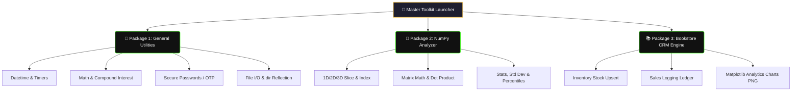

# Bookstore-Inventory-
# 🛠️ Multi-Utility Master Suite

<div align="center">
  <!-- Premium Native CSS Animated Header Card -->
  <div style="background: linear-gradient(135deg, #1e1e2f 0%, #111e38 100%); padding: 35px; border-radius: 12px; box-shadow: 0 6px 20px rgba(0,0,0,0.4); border: 2px solid #39FF14; max-width: 700px; margin: 20px auto; overflow: hidden;">
    <h1 style="color: #FFD166; margin: 0 0 10px 0; font-family: 'Fira Code', monospace; font-size: 28px; text-shadow: 0 0 12px rgba(255,209,102,0.4);">🚀 Core Python Multi-Utility Toolkit</h1>
    
    <!-- CSS Typing Animation -->
    <div style="display: inline-block; font-family: 'Fira Code', monospace; font-weight: 600; font-size: 16px; color: #39FF14; border-right: 2px solid #39FF14; white-space: nowrap; overflow: hidden; width: 0; animation: typing 4s steps(45, end) infinite alternate;">
      3-in-1 Suite: General Utils | NumPy Matrix Analyzer | Bookstore CRM
    </div>
    
    <p style="color: #E2E8F0; margin: 15px 0 0 0; font-family: system-ui, sans-serif; font-size: 14px; line-height: 1.6;">
      दैनिक टूल्स, वैज्ञानिक मैट्रिक्स गणना (NumPy) और पूर्ण बुकस्टोर इन्वेंट्री-कम-एनालिटिक्स सिस्टम को संभालने के लिए बनाया गया एक शक्तिशाली, इंटरैक्टिव और कमांड-लाइन आधारित कंसोल पावरहाउस।
    </p>
  </div>
</div>

<style>
  @keyframes typing {
    0% { width: 0; }
    75% { width: 100%; }
    100% { width: 100%; }
  }
</style>

---

## 🗺️ संपूर्ण सिस्टम आर्किटेक्चर (Workflow Flowchart)

यह सुइट 3 अलग-अलग मोड्युलरी पैकेजों में बंटा हुआ है जो आपके टर्मिनल को एक सुपर-ऐप में बदल देते हैं:



---

## ⚡ मुख्य मॉड्यूल और उनके फीचर्स (Module Overview)

नीचे दिए गए किसी भी पैकेज को एक्सपैंड (खोलकर) करके उसके अंदर की सभी क्षमताएं देखें:

<details open>
<summary>📦 मॉड्यूल 1: सामान्य उपयोगिताएँ (General Utilities)</summary>
<br>

* 📅 **समय और दिनांक:** रीयल-टाइम क्लॉक स्टैम्प देखना और दो तारीखों के बीच का अंतर निकालना।
* ⏱️ **स्टॉपवॉच और टाइमर:** टर्मिनल के अंदर लाइव पॉज़िंग के साथ सटीक काउंटडाउन और स्टॉपवॉच।
* 🔐 **सिक्योरिटी टोकन्स:** रैंडम अल्फ़ान्यूमेरिक पासवर्ड जनरेटर और वन-टाइम पासकोड (OTP) जनरेटर।
* 📂 **फ़ाईल सिस्टम और रिफ्लेक्शन:** फ़ाइलों को सुरक्षित तरीके से पढ़ना/लिखना और `dir()` का उपयोग करके लाइब्रेरी एट्रिब्यूट्स की जांच करना।
</details>

<details>
<summary>🧮 मॉड्यूल 2: न्यूमपाय मैट्रिक्स विश्लेषक (NumPy Analyzer)</summary>
<br>

* 🧊 **N-Dimensional Array Factory:** आसानी से 1D वेक्टर्स, 2D मेट्रिसेस या जटिल 3D एरेज़ का निर्माण।
* 🔪 **डायनामिक स्लाइसिंग:** इनपुट स्ट्रिंग्स (जैसे `0:2, 1:3`) के ज़रिए मैट्रिक्स के किसी भी हिस्से को काटना।
* 📈 **एडवांस्ड स्टैटिस्टिक्स:** कुल योग (Sum), माध्य (Mean), मानक विचलन (Standard Deviation/σ) और कोरिलेशन कोएफिशिएंट निकालना।
</details>

<details>
<summary>📊 मॉड्यूल 3: बुकस्टोर इन्वेंट्री और एनालिटिक्स (Bookstore CRM)</summary>
<br>

* 📥 **स्मार्ट कैटलॉग:** किताबें जोड़ें। यदि किताब पहले से मौजूद है, तो यह डुप्लिकेट बनाने के बजाय सीधे मात्रा बढ़ा देता है।
* 💰 **बिक्री खाता (Sales Ledger):** लाइव सेल्स को रिकॉर्ड करना, स्टॉक से किताबें घटाना और कुल रेवेन्यू का ऑडिट करना।
* 🎨 **ऑटो-ग्राफ जनरेटर (Matplotlib):** एक सिंगल क्लिक में निम्नलिखित व्यावसायिक विज़ुअलाइज़ेशन चार्ट्स को `.png` इमेज के रूप में सेव करना:
  - `chart_sales_by_genre.png` (शैली आधारित बिक्री बार चार्ट)
  - `chart_monthly_trend.png` (मासिक बिक्री का उतार-चढ़ाव)
  - `chart_revenue_pie.png` (कमाई का प्रतिशत पाई चार्ट)
  - `chart_price_sales_heatmap.png` (कीमत और मांग का हीटमैप)
</details>

---

## 🚀 इंस्टॉलेशन और रन करने की प्रक्रिया

### 1. सिस्टम आवश्यकताएँ (Dependencies)
इस सुइट के सामान्य यूटिलिटी टूल्स बिना किसी बाहरी लाइब्रेरी के चलते हैं, लेकिन **NumPy** और **Bookstore Charts** के लिए नीचे दिए गए पैकेजों को इंस्टॉल करना ज़रूरी है:
```bash
pip install numpy pandas matplotlib seaborn
```

### 2. सुइट को टर्मिनल में चलाएं
```bash
python main_toolkit.py
```

---

## 💻 सैंपल रन लॉग्स (System Logs Breakdown)

```text
==========================================
        MULTI-UTILITY MASTER SUITE
==========================================
Current Date and Time: 2026-09-11 12:51:44
Difference: 127 days | Generated Password: TY2QsTi1B1py

--- NumPy Array created successfully ---
[[ 10  30  50]
 [ 70  90 110]]
Standard Deviation of Array: 34.15650255319866

--- Bookstore Summary Report ---
Books in catalog        : 26
Total units in stock    : 1878
Total sales transactions: 825
Total revenue to date   : \$33,763.04

[SAVED] chart_sales_by_genre.png
[SAVED] chart_monthly_trend.png
[SAVED] chart_revenue_pie.png
==========================================
Data saved successfully. Goodbye!
```

---

<!-- GitHub-Friendly Professional UI Custom Theme Style -->
<style>
  summary {
    font-size: 1.1rem;
    padding: 14px;
    background: #0d1117;
    border-radius: 8px;
    margin-bottom: 10px;
    cursor: pointer;
    border-left: 4px solid #39FF14;
    transition: all 0.2s ease-in-out;
    list-style: none;
    font-family: system-ui, sans-serif;
    color: #c9d1d9;
  }
  summary:hover {
    background: #161b22;
    transform: translateX(5px);
    color: #58a6ff;
  }
  summary::-webkit-details-marker {
    display: none;
  }
</style>
