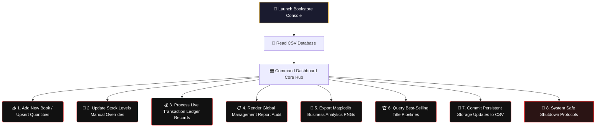

# Bookstore-Inventory-
# 📚 Bookstore Inventory & Analytics System

<div align="center">
  <!-- Premium Native CSS Animated Header Card -->
  <div style="background: linear-gradient(135deg, #1A1B2F 0%, #162A45 100%); padding: 35px; border-radius: 12px; box-shadow: 0 6px 20px rgba(0,0,0,0.4); border: 2px solid #FF6B6B; max-width: 650px; margin: 20px auto; overflow: hidden;">
    <h1 style="color: #FFD166; margin: 0 0 10px 0; font-family: 'Fira Code', monospace; font-size: 26px; text-shadow: 0 0 12px rgba(255,209,102,0.4);">📖 Bookstore CRM & Analytics Engine</h1>
    
    <!-- CSS Typing Animation -->
    <div style="display: inline-block; font-family: 'Fira Code', monospace; font-weight: 600; font-size: 16px; color: #45C4B0; border-right: 2px solid #45C4B0; white-space: nowrap; overflow: hidden; width: 0; animation: typing 4s steps(45, end) infinite alternate;">
      Inventory Tracker | Sales Reports | Automated Charts Generator
    </div>
    
    <p style="color: #E2E8F0; margin: 15px 0 0 0; font-family: system-ui, sans-serif; font-size: 14px; line-height: 1.6;">
      An interactive Command Line Interface (CLI) database system designed to automate warehouse inventory levels, process multi-item sales transactions, and export comprehensive business insight graphs natively.
    </p>
  </div>
</div>

<style>
  @keyframes typing {
    0% { width: 0; }
    75% { width: 100%; }
    100% { width: 100%; }
  }
</style>

---

## ⚡ Core System Features

Click open the target disclosures below to explore sub-menu capabilities:

<details open>
<summary><b>📦 1. Smart Catalog & Stock Management</b></summary>
<br>

* 🆕 **Duplication Guard Upsert:** Add fresh book titles seamlessly. If a record already exists, the engine automatically catches it and converts the operation into a stock top-up rather than generating duplicate items.
* 🔄 **Inventory Overrides:** Modify individual book volumes directly at any time to balance physical shelf stocks easily.
</details>

<details>
<summary><b>💰 2. Transaction Stream & Sales Logging</b></summary>
<br>

* 📝 **Real-Time Billing:** Record individual customer order volumes. The application deducts the exact units from active inventory counts while generating instant revenue tallies.
</details>

<details>
<summary><b>📋 3. Automated Business Summary Audits</b></summary>
<br>

* 📊 **Ledger Summarizer:** Compile holistic metric overviews detailing total tracking titles, collective stocks, average book valuations, historic transaction footprints, and aggregate revenue.
* 🏆 **Bestseller Ranker:** Isolate your highest performing titles filtered by gross sales volume and individual revenue contributions.
</details>

<details>
<summary><b>🎨 4. Matplotlib Visualizations Analytics Suite</b></summary>
<br>

* 📊 **Automated Export Pipeline:** Render and save high-fidelity standalone graphical summaries straight to the workspace root directory:
  - `chart_sales_by_genre.png` (Genre performance distribution bar metric)
  - `chart_monthly_trend.png` (Chronological purchase timeline velocity tracking)
  - `chart_revenue_pie.png` (Profit contribution share slice allocation matrix)
  - `chart_price_sales_heatmap.png` (Price elasticity and demand cluster evaluation mapping)
</details>

---

## 🗺️ System Operation Workflow

The engine runs within a persistent operational loop that references flat-file databases to verify state consistency across inventory loads, updates, and disk commits:



---

## 🚀 Environment Setup & Deployment

### 1. Requirements Checklist
Ensure your Python runtime environment has all necessary data manipulation and analytics packages configured before initiating execution scripts:
```bash
pip install pandas matplotlib seaborn
```

### 2. Execution Core Command
Run the system console dashboard script directly from your terminal:
```bash
python bookstore_analytics.py
```

---

## 💻 Sample Program Stream Execution Logs

```text
Bookstore system loaded:
  26 books in inventory, 824 sales records.

----- Bookstore Inventory & Analytics System -----
1. Add a new book
...
'The Midnight Ledger' already existed — quantity increased by 30.
Updated 'The Midnight Ledger' stock to 75 units.
Recorded sale: 5 x 'The Midnight Ledger' = \$79.95

=======================================================
BOOKSTORE SUMMARY REPORT
=======================================================
Books in catalog        : 26
Total units in stock    : 1878
Average book price      : \$16.74
Total sales transactions: 825
Total revenue to date   : \$33,763.04
=======================================================

Saved: chart_sales_by_genre.png | chart_monthly_trend.png
Inventory and sales data saved.
Goodbye!
```

---

<!-- Premium Safe Markdown UI Custom Styles Component -->
<style>
  summary {
    font-size: 1.1rem;
    padding: 14px;
    background: #0f141c;
    border-radius: 8px;
    margin-bottom: 10px;
    cursor: pointer;
    border-left: 4px solid #FF6B6B;
    transition: all 0.2s ease-in-out;
    list-style: none;
    font-family: system-ui, sans-serif;
    color: #cbd5e1;
  }
  summary:hover {
    background: #1e293b;
    transform: translateX(5px);
    color: #FFD166;
  }
  summary::-webkit-details-marker {
    display: none;
  }
</style>
